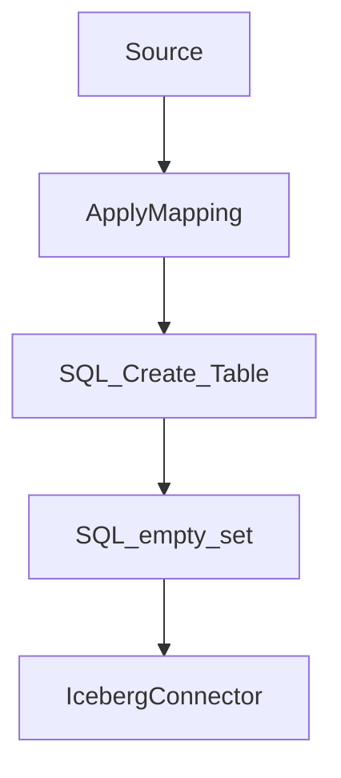

## AWS GLUE/Iceberg/Dremio 

### Get Iceberg Connector

[LINK TO AWS ICEBERG CONNECTOR](https://aws.amazon.com/marketplace/pp/prodview-iicxofvpqvsio)

### Create Iceberg Connection

[LINK TO CREATE CONNECTION](https://console.aws.amazon.com/gluestudio/home?region=us-east-1#/connector/add-connection?connectorName=%22Iceberg%20Connector%20for%20Glue%203.0%22&connectorType=%22Spark%22&connectorDescription=%22Connect%20Iceberg%20sources%22&connectorUrl=%22https%3A%2F%2F709825985650.dkr.ecr.us-east-1.amazonaws.com%2Famazon-web-services%2Fglue%2Ficeberg%3A0.12.0-glue3.0%22&connectorVersion=%220.12.0-glue3.0%22&connectorClassName=%22iceberg%22)

### Create IAM Policy and Attach to New Role

- Create new IAM Policy with Glue as trusted entity
- Make sure to replace "##########" with userid number
- Create new role with policy attached

```json
{
    "Version": "2012-10-17",
    "Statement": [
        {
            "Sid": "VisualEditor0",
            "Effect": "Allow",
            "Action": [
                "logs:CreateLogDelivery",
                "logs:PutDestinationPolicy",
                "ecr:GetDownloadUrlForLayer",
                "ecr:DescribeRegistry",
                "ecr:BatchGetImage",
                "ecr:GetAuthorizationToken",
                "s3:CreateJob",
                "ecr:BatchCheckLayerAvailability"
            ],
            "Resource": "*"
        },
        {
            "Sid": "VisualEditor1",
            "Effect": "Allow",
            "Action": [
                "glue:GetDatabase",
                "s3:PutObject",
                "s3:GetObject",
                "glue:GetConnections",
                "glue:GetConnection",
                "glue:CreateTable",
                "glue:UpdateTable",
                "s3:DeleteObject",
                "logs:PutLogEvents",
                "glue:GetTable"
            ],
            "Resource": [
                "arn:aws:glue:*:############:database/*",
                "arn:aws:glue:*:############:table/*/*",
                "arn:aws:glue:*:############:catalog",
                "arn:aws:glue:*:############:connection/*",
                "arn:aws:logs:*:############:log-group:*:log-stream:*",
                "arn:aws:s3:::*/*"
            ]
        },
        {
            "Sid": "VisualEditor2",
            "Effect": "Allow",
            "Action": [
                "s3:PutBucketNotification",
                "logs:PutMetricFilter",
                "logs:CreateLogStream",
                "s3:PutBucketLogging",
                "s3:CreateBucket",
                "logs:CreateLogGroup"
            ],
            "Resource": [
                "arn:aws:s3:::*",
                "arn:aws:logs:*:############:log-group:*"
            ]
        }
    ]
}
```

### Create Glue Job (us-east-1)

[Link to Glue Dashboard](https://console.aws.amazon.com/gluestudio/home?region=us-east-1#/)

- dataset: `s3://alex-m-dremio/dremio_datasets/Worker_Coops.csv`
- 

