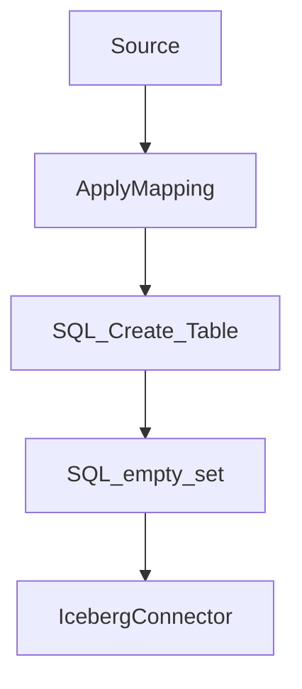

## AWS GLUE/Iceberg/Dremio 

### Get Iceberg Connector

[LINK TO AWS ICEBERG CONNECTOR](https://aws.amazon.com/marketplace/pp/prodview-iicxofvpqvsio)

### Create Iceberg Connection

[LINK TO CREATE CONNECTION](https://console.aws.amazon.com/gluestudio/home?region=us-east-1#/connector/add-connection?connectorName=%22Iceberg%20Connector%20for%20Glue%203.0%22&connectorType=%22Spark%22&connectorDescription=%22Connect%20Iceberg%20sources%22&connectorUrl=%22https%3A%2F%2F709825985650.dkr.ecr.us-east-1.amazonaws.com%2Famazon-web-services%2Fglue%2Ficeberg%3A0.12.0-glue3.0%22&connectorVersion=%220.12.0-glue3.0%22&connectorClassName=%22iceberg%22)

### Create IAM Policy and Attach to New Role

- Create new IAM Policy with Glue as trusted entity
- Make sure to replace "##########" with userid number
- Create new role with policy attached

```json
{
    "Version": "2012-10-17",
    "Statement": [
        {
            "Sid": "VisualEditor0",
            "Effect": "Allow",
            "Action": [
                "logs:CreateLogDelivery",
                "logs:PutDestinationPolicy",
                "ecr:GetDownloadUrlForLayer",
                "ecr:DescribeRegistry",
                "ecr:BatchGetImage",
                "ecr:GetAuthorizationToken",
                "s3:CreateJob",
                "ecr:BatchCheckLayerAvailability"
            ],
            "Resource": "*"
        },
        {
            "Sid": "VisualEditor1",
            "Effect": "Allow",
            "Action": [
                "glue:GetDatabase",
                "s3:PutObject",
                "s3:GetObject",
                "glue:GetConnections",
                "glue:GetConnection",
                "glue:CreateTable",
                "glue:UpdateTable",
                "s3:DeleteObject",
                "logs:PutLogEvents",
                "glue:GetTable"
            ],
            "Resource": [
                "arn:aws:glue:*:############:database/*",
                "arn:aws:glue:*:############:table/*/*",
                "arn:aws:glue:*:############:catalog",
                "arn:aws:glue:*:############:connection/*",
                "arn:aws:logs:*:############:log-group:*:log-stream:*",
                "arn:aws:s3:::*/*"
            ]
        },
        {
            "Sid": "VisualEditor2",
            "Effect": "Allow",
            "Action": [
                "s3:PutBucketNotification",
                "logs:PutMetricFilter",
                "logs:CreateLogStream",
                "s3:PutBucketLogging",
                "s3:CreateBucket",
                "logs:CreateLogGroup"
            ],
            "Resource": [
                "arn:aws:s3:::*",
                "arn:aws:logs:*:############:log-group:*"
            ]
        }
    ]
}
```

### Create Glue Job (us-east-1)

[Link to Glue Dashboard](https://console.aws.amazon.com/gluestudio/home?region=us-east-1#/)


**Source**

- dataset: `s3://alex-m-dremio/dremio_datasets/Worker_Coops.csv`
- uncheck recursive
- make sure all fields are strings

**ApplyMapping**

- Change the two Number of Worker-Owner fields to the Int data type
- Change Latitude and Longitude to the float data type

**SQL_Create_Table**

- `CREATE TABLE my_catalog.db.nyc_worker_coops AS (SELECT * FROM myDataSource);`

**SQL_empty_set**

- `select * FROM my_catalog.db.nyc_worker_coops LIMIT 0;`

**IcebergConnector**

1. Select the “Iceberg Connector” box in the visual editor pane on the left. 
2. In the “Data target properties” tab, choose the Iceberg connection configured earlier for the “Connection” property.
3. Under “Connection options,” click “Add new option” and set the “Key” as `path` and the “Value” as `my_catalog.db.nyc_worker_coops` (again, replace “db” with the name you chose for your Glue database). This path variable specifies the Iceberg table that the connector will try to write to.




### Job Settings

- Select Glue with Spark
- Select Python as language
- 

- add a job parameter with the key of `--conf` and value of:

```
spark.sql.catalog.my_catalog=org.apache.iceberg.spark.SparkCatalog --conf spark.sql.catalog.my_catalog.warehouse=s3://my-output-directory --conf spark.sql.catalog.my_catalog.catalog-impl=org.apache.iceberg.aws.glue.GlueCatalog --conf spark.sql.catalog.my_catalog.io-impl=org.apache.iceberg.aws.s3.S3FileIO --conf spark.sql.extensions=org.apache.iceberg.spark.extensions.IcebergSparkSessionExtensions
```
*Make sure to replace `s3://my-output-directory` with a valid s3 address*

- Additional optional configurations to use dynamo db as a lock table

```
--conf spark.sql.catalog.my_catalog.lock.table=<DynamoDB_TABLE_NAME>
--conf spark.sql.catalog.my_catalog.lock-impl=org.apache.iceberg.aws.glue.DynamoLockManager
```

## Connect to Dremio

- Add AWS Glue as a Data Source

- Run the following query

```sql
SELECT * 
FROM nyc_worker_coops 
WHERE Subtype = 'Coaching'
```

- setup reflections reflecting borough/subtype as dimentions and the "number of worker" fields as measures

- Run the following query

```
SELECT Borough, Subtype, SUM("Number of Worker-Owners") AS Total_Worker_Owners,
SUM("Number of Non-Member Worker-Owners") AS Total_Non_Worker_Owners 
FROM nyc_worker_coops 
GROUP BY Borough, Subtype
```
